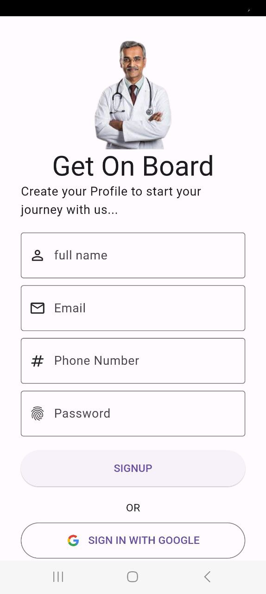
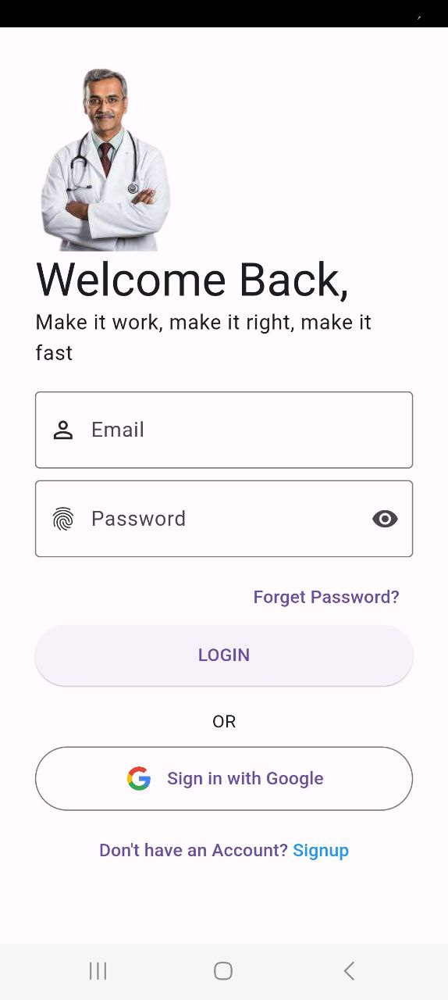
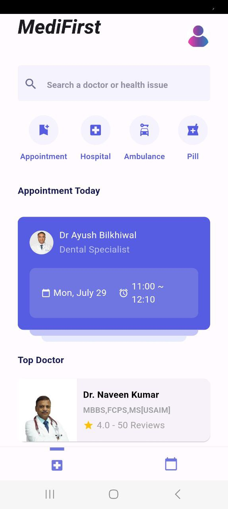
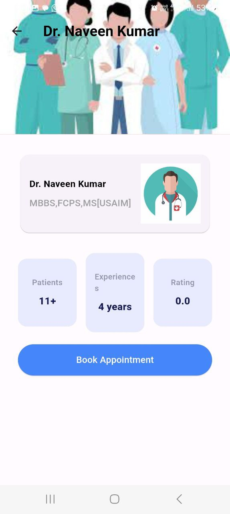
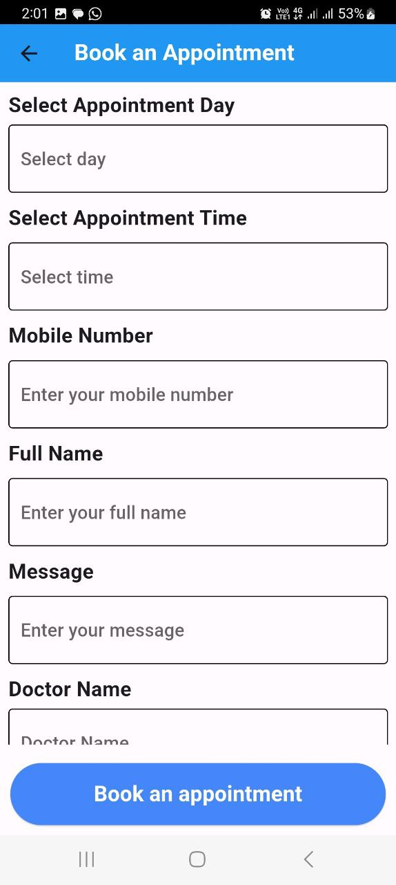
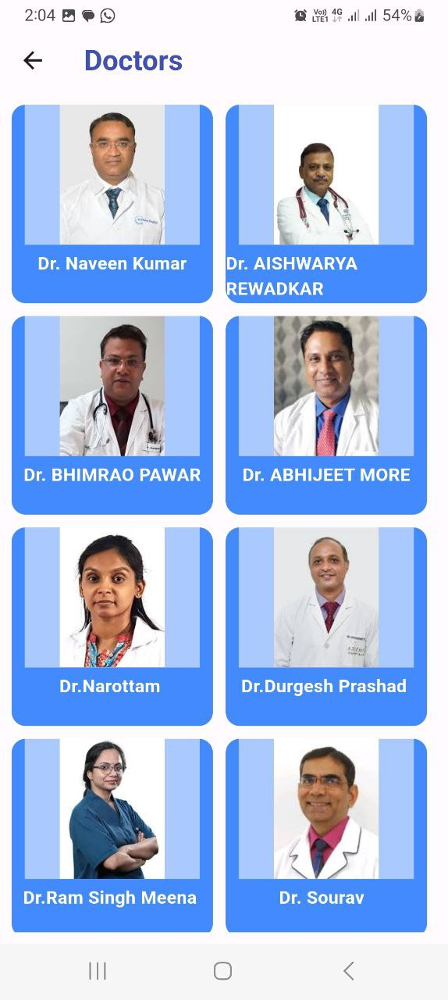
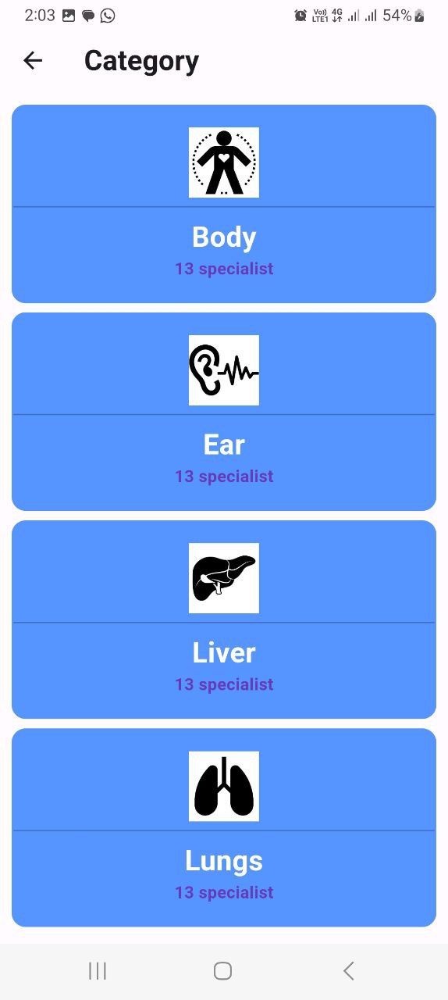
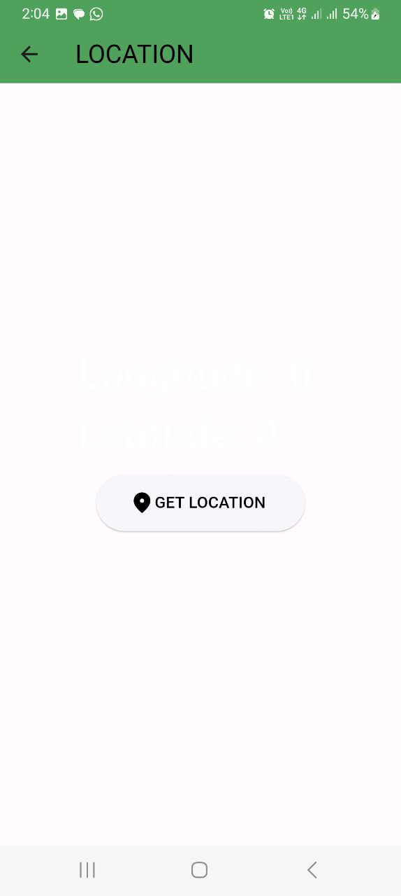
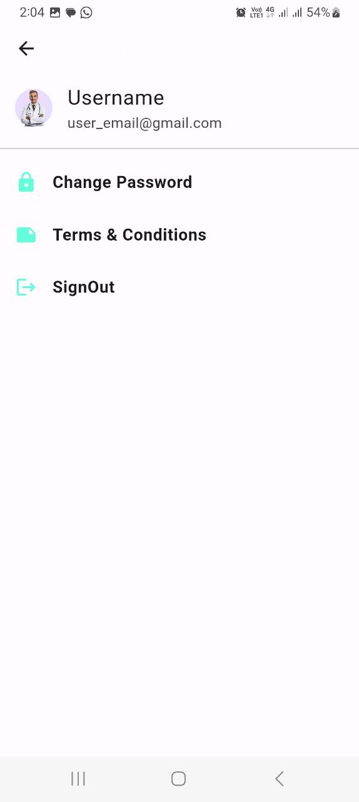
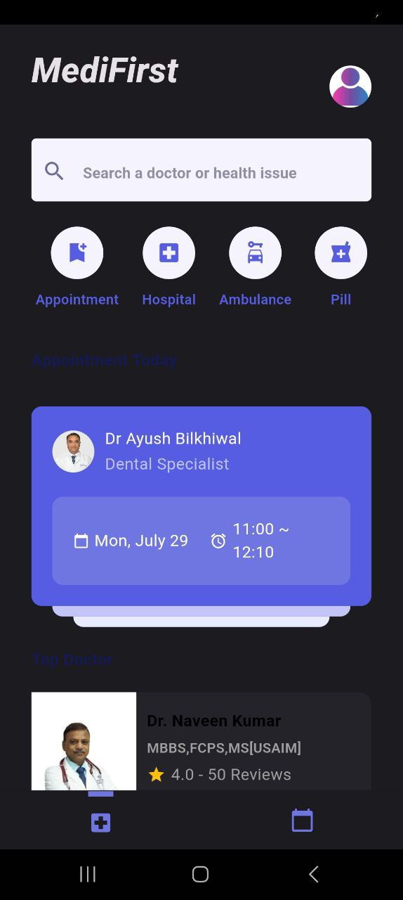

# MediFirst


## Overview

MediFirst is an all-in-one health management application designed to simplify and enhance your healthcare experience. With seamless integration with Firebase, our app provides a secure and efficient platform for users to manage their health-related activities, appointments, and emergencies.


## Features

0. Light/dark mode toggle

1. Authentication (Login & Signup)
Securely access your personalized health profile by logging in with your credentials. New users can easily sign up to create an account.

2. Doctor Appointment
Schedule and manage appointments with MediFirst professionals effortlessly. Browse through a list of qualified doctors, select your preferred time slot, and receive timely reminders.

3. Ambulance Booking
In case of emergencies, quickly book an ambulance directly through the app. Provide your location, and our integrated service ensures a prompt response to your medical needs.

4. Upcoming Appointments
Stay organized with a dedicated section for upcoming appointments. Receive notifications, view details, and make any necessary preparations for your medical visits.

5. Past Appointments
Access a comprehensive history of your past appointments, including details of consultations, prescribed medications, and any post-appointment instructions.

6. Firebase Integration
Our app leverages the power of Firebase for secure user authentication, real-time database updates, and efficient cloud storage. Your health data is always accessible and synchronized across devices.


## How to get Started


Create an Account:

Sign up for a new account or log in if you already have one.

Explore Features:

Discover the various features available for managing your health and appointments.

Schedule Appointments:

Use the Doctor Appointment feature to schedule consultations with healthcare professionals.

Book an Ambulance:

In emergencies, utilize the Ambulance Booking feature for a quick and efficient response.

MediFirst is committed to providing a user-friendly, secure, and efficient healthcare platform. Whether you're scheduling a routine check-up or need urgent medical assistance, HealthHub is here to make your health journey smoother.

## Installation


```bash
installation commands
https://github.com/AyushBilkhiwal/MediFirst.git
cd MediFirst
./setup.sh
```


## WorkFlow/Screenshots
## Screenshots

<div style="display: flex; justify-content: space-around; align-items: center;">
  <div>
    
    <p style="text-align: center;">Screenshot 1</p>
  </div>
  <p>→</p>
  <div>
    
    <p style="text-align: center;">Screenshot 2</p>
  </div>
  <p>→</p>
  <div>
    
    <p style="text-align: center;">Screenshot 3</p>
  </div>
  <p>→</p>
  <div>
    
    <p style="text-align: center;">Screenshot 4</p>
  </div>
  <p>→</p>
  <div>
    
    <p style="text-align: center;">Screenshot 5</p>
  </div>
  <p>→</p>
  <div>
    
    <p style="text-align: center;">Screenshot 6</p>
  </div>
  <p>→</p>
  <div>
    
    <p style="text-align: center;">Screenshot 7</p>
  </div>
  <p>→</p>
  <div>
    
    <p style="text-align: center;">Screenshot 8</p>
  </div>
  <p>→</p>
  <div>
    
    <p style="text-align: center;">Screenshot 9</p>
  </div>
  <p>→</p>
  <div>
    
    <p style="text-align: center;">Screenshot 10</p>
  </div>
  <p>→</p>
  <div>
    
    <p style="text-align: center;">Screenshot 11</p>
  </div>
  <p>→</p>
  <div>
    
    <p style="text-align: center;">Dark Mode View</p>
  </div>
  <!-- Repeat for other images -->
</div>


## Tech Stack


**Technologies:** Flutter, Dart, FireBase,

**Software:** Visual Studio, Android Studio,

**dependencies:**
  google_fonts: ^6.1.0
  flutter_native_splash: ^2.3.9
  get: ^4.6.6
  flutter_otp_text_field: ^1.1.1
  otp_text_field: ^1.1.3
  firebase_core: ^2.24.2
  firebase_auth: ^4.16.0
  google_sign_in: ^6.2.1
  cupertino_icons: ^1.0.6
  line_awesome_flutter: ^2.0.0
  flutter_map: ^6.1.0
  latlong2: ^0.9.0
  font_awesome_flutter: ^10.7.0
  cloud_firestore: ^4.14.0
  velocity_x: ^4.1.2
  table_calendar: ^3.0.9
  geolocator: ^10.1.0

## 🔗 Links
Hariom Meena<br>
Linkedin: https://www.linkedin.com/in/hariom-meena-50b13a205/  <br>
Github:  https://github.com/Hariommeena2000  <br>
Ayush Bilkhiwal <br>

Github: https://github.com/AyushBilkhiwal/MediFirst <br>

Linkedin: https://www.linkedin.com/in/ayush-bilkhiwal-935672232/  <br>


